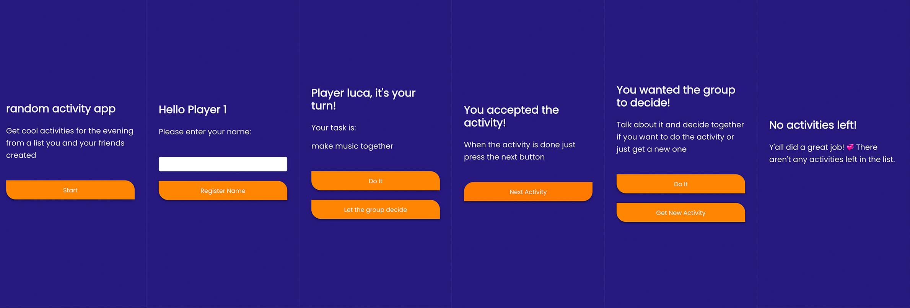

# random activity app

A fun little game for you and your friends to get random activities for the evening from a list y'all created! It's relatively simple and kinda inspired by truth or dare, but with less of a forced vibe :D

## Live Site
The SPA can be tested with some demo data on the following website: https://random-activity-spa.netlify.app/

## Screenshots
Here are all the different screens from the game.


## Recommended IDE Setup

[VSCode](https://code.visualstudio.com/) + [Volar](https://marketplace.visualstudio.com/items?itemName=johnsoncodehk.volar) + [TypeScript Vue Plugin (Volar)](https://marketplace.visualstudio.com/items?itemName=johnsoncodehk.vscode-typescript-vue-plugin).

## Project Setup
The Game should be run locally! You need to have node and npm installed in order to use the game (get the lts version of node and npm from [nodejs.org](https://nodejs.org/en/)).

First you ned to install the project dependencies:

```sh
npm i
```

Then you can start a local dev server with the following command:

```sh
npm run dev
```

The local webserver will be available under http://localhost:3000/. There you can use the game.

## Include activities from you and your friends:
To include your own activities you can go to the player.js file under "/src/stores/players.js".

For every player you need to create a specific array with "export const _player_" (_player_ needs to be replaced by a key for example player1 or the name of the player). You also need to update the const "playerAmount" in line 5, to match it to the current number of player arrays.

In order to add all acitivies into one array you need to open the main.js file under "src/main.js". There you have the global property "activities" in line 16. To merge all array you need to edit the players.player1.concat(). player1 must be the first array in your players.js file. Then in the () you add all other player arrays you created with "players._player_" (_player_ must be replaced by it's respective key you've given the array in your players.js file).

After that everything is done and you can start the game under http://localhost:3000/ &#128578;
